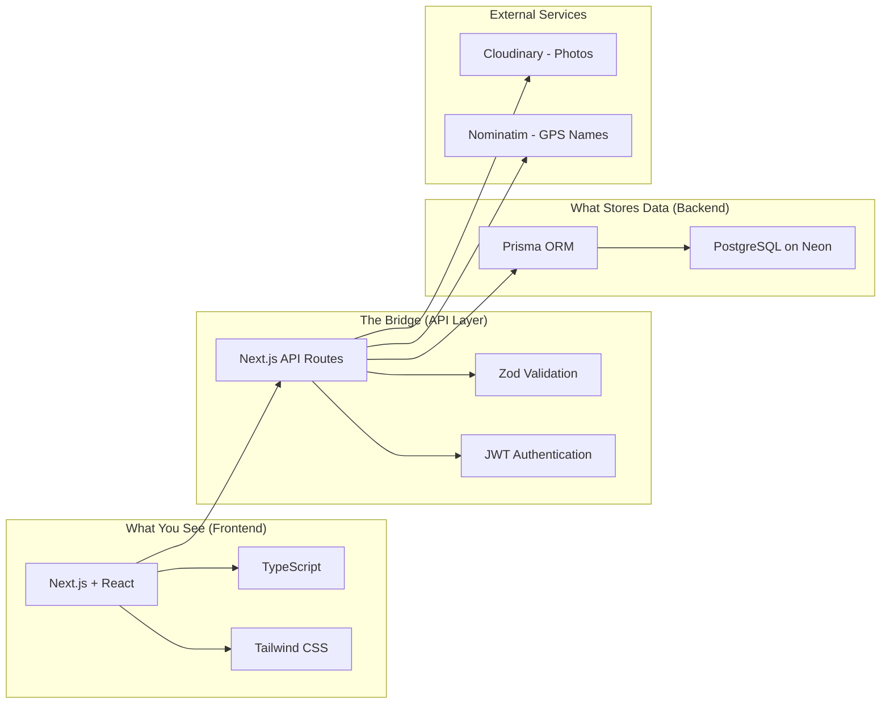
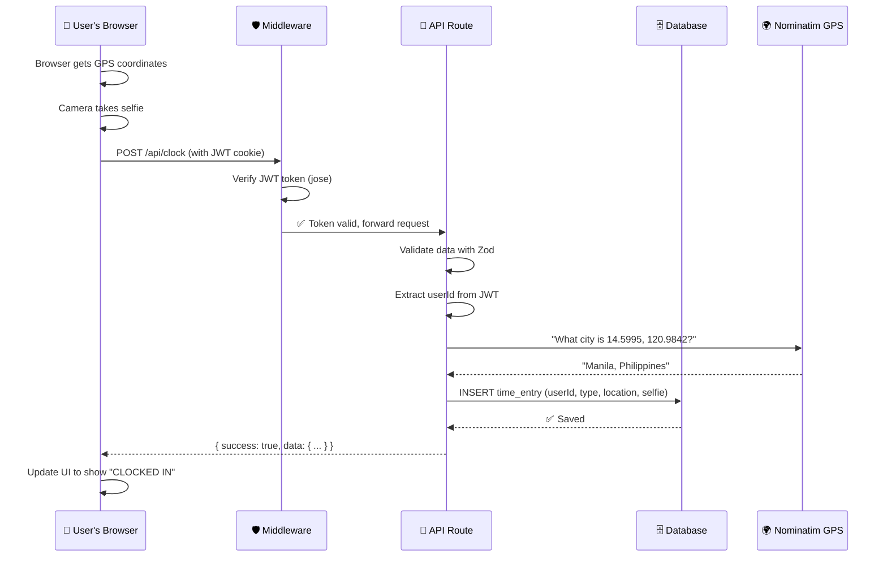

# Taply MVP — Complete Architecture Walkthrough

> This document explains **everything** that was built — from the UI prototype to the fully-functional MVP — in plain language.

---

## Table of Contents

1. [What Changed: Before vs After](#1-what-changed-before-vs-after)
2. [The Tech Stack Explained](#2-the-tech-stack-explained)
3. [Architecture: How Everything Connects](#3-architecture-how-everything-connects)
4. [The `app/` vs `app/api/` Question](#4-the-app-vs-appapi-question)
5. [Every File We Created or Changed](#5-every-file-we-created-or-changed)
6. [Design Decisions & Why](#6-design-decisions--why)
7. [Things to Remember](#7-things-to-remember-when-continuing)
8. [Git Commands](#8-git-commands)

---

## 1. What Changed: Before vs After

### Before (UI Prototype)
Your original Taply was a **frontend-only demo**. Think of it like a movie set — it *looks* like a real building, but there's nothing behind the walls.

| Feature | Prototype Behavior |
|---|---|
| User identity | Hardcoded as "Alex Rivera" — always |
| Time entries | Fake data baked into the code |
| Team map | Static bubbles with made-up locations |
| Reports | Pre-written numbers, no calculations |
| Login | Didn't exist |
| Database | Didn't exist |

### After (MVP)
Now it's a **real building** — doors lock, lights work, water flows.

| Feature | MVP Behavior |
|---|---|
| User identity | JWT authentication — real login/logout |
| Time entries | Stored in PostgreSQL, tied to real users |
| Team map | Reads live status from the database |
| Reports | Calculated from actual time entries |
| Login | Full auth system with registration |
| Database | PostgreSQL on Neon (cloud), 6 tables |
| GPS | Real browser geolocation + reverse geocoding |
| Selfie | Camera capture + Cloudinary cloud storage |
| Roles | Manager sees everything; Employee sees own data only |

---

## 2. The Tech Stack Explained

### What Each Tool Does



### Plain-English Explanations

| Tool | What It Is | Analogy |
|---|---|---|
| **Next.js 16** | A framework that lets you build the website AND the server in one project | Like a restaurant where the kitchen (server) and dining room (website) are in the same building |
| **React** | A library for building user interfaces with reusable pieces called "components" | Like LEGO — you build small blocks (buttons, cards) and snap them together into pages |
| **TypeScript** | JavaScript with type-checking — catches bugs before you run the code | Like spell-check for code |
| **Prisma ORM** | Translates your JavaScript code into SQL database queries | Like a translator between you and the database — you say "find user by email" and Prisma writes the SQL |
| **PostgreSQL** | The actual database that stores all user data, time entries, reports | Like a giant Excel spreadsheet that's really fast and safe |
| **Neon** | A cloud service that hosts your PostgreSQL database for free | Like Google Drive but for databases |
| **JWT (JSON Web Token)** | A secure "ID card" the server gives you after login, stored in a cookie | Like a wristband at a concert — proves you're allowed in |
| **jose** | A library to verify JWTs at the "edge" (before the page even loads) | The bouncer who checks your wristband at the door |
| **bcryptjs** | Hashes (scrambles) passwords so nobody can read them, not even you | Like a paper shredder — you can verify a document matches the shredded version, but can't reconstruct it |
| **Zod** | Validates incoming data — checks that emails look like emails, passwords are long enough | Like a bouncer checking your ID format |
| **Cloudinary** | Cloud storage for images (selfie uploads) | Like Google Photos but for your app |
| **Nominatim** | OpenStreetMap's free geocoding API — turns GPS coordinates into city names | GPS says "40.7128, -74.0060" → Nominatim says "New York, NY" |
| **@prisma/adapter-pg** | The "driver" that connects Prisma to PostgreSQL (required in Prisma 7) | Like a USB adapter — connects Prisma (the device) to PostgreSQL (the port) |

---

## 3. Architecture: How Everything Connects

### The Request Lifecycle

When a user clicks "Clock In", here's what happens step by step:



### The Three Layers

```
┌──────────────────────────────────────────────────┐
│                    FRONTEND                       │
│  app/page.tsx, app/clock/page.tsx, etc.           │
│  (What the user sees and interacts with)          │
│  • Uses React hooks (useState, useEffect)         │
│  • Calls fetch('/api/...') to talk to backend     │
│  • Reads auth state from AuthContext              │
├──────────────────────────────────────────────────┤
│                   API LAYER                       │
│  app/api/clock/route.ts, app/api/logs/route.ts    │
│  (The "kitchen" — processes requests)             │
│  • Validates input (Zod)                          │
│  • Checks authentication (JWT)                    │
│  • Checks authorization (Role: MANAGER/EMPLOYEE)  │
│  • Talks to database (Prisma)                     │
│  • Returns JSON responses                         │
├──────────────────────────────────────────────────┤
│                   DATA LAYER                      │
│  lib/db.ts → Prisma → PostgreSQL (Neon)           │
│  (The "storage room" — holds all data)            │
│  • 6 tables: organizations, users, time_entries,  │
│    reports, report_days, sessions                  │
└──────────────────────────────────────────────────┘
```

---

## 4. The `app/` vs `app/api/` Question

This is the most important architectural concept to understand.

### `app/` folders (Pages — what the user SEES)

```
app/
├── page.tsx          ← Dashboard (the home page at "/")
├── clock/
│   └── page.tsx      ← Clock In/Out page at "/clock"
├── logs/
│   └── page.tsx      ← Attendance Logs page at "/logs"
├── map/
│   └── page.tsx      ← Team Map page at "/map"
├── reports/
│   └── page.tsx      ← Reports page at "/reports"
└── profile/
    └── page.tsx      ← Profile page at "/profile"
```

These are **React components** that render HTML. When you visit `localhost:3000/clock`, Next.js loads `app/clock/page.tsx` and shows it in the browser. They contain:
- The visual layout (buttons, cards, text)
- `useEffect` hooks that call the APIs to fetch data
- `useState` hooks to manage what's displayed
- Event handlers (what happens when you click a button)

**Think of these as the "dining room" of a restaurant** — it's what customers see and interact with.

### `app/api/` folders (API Routes — what runs on the SERVER)

```
app/api/
├── auth/
│   ├── login/route.ts     ← POST /api/auth/login
│   ├── register/route.ts  ← POST /api/auth/register
│   ├── me/route.ts        ← GET  /api/auth/me
│   └── logout/route.ts    ← POST /api/auth/logout
├── clock/route.ts         ← GET & POST /api/clock
├── logs/route.ts          ← GET /api/logs
├── team/route.ts          ← GET /api/team
├── reports/
│   ├── route.ts           ← GET /api/reports
│   └── [id]/route.ts      ← GET & PATCH /api/reports/:id
├── profile/route.ts       ← GET & PATCH /api/profile
└── upload/route.ts        ← POST /api/upload
```

These are **server-side functions** that handle data. They never render HTML — they only return JSON data. When the Clock page calls `fetch('/api/clock')`, it hits `app/api/clock/route.ts` on the server.

Each file exports functions named after HTTP methods:
- `export async function GET()` — handles GET requests (read data)
- `export async function POST()` — handles POST requests (create/send data)
- `export async function PATCH()` — handles PATCH requests (update data)

**Think of these as the "kitchen"** — customers never see it, but it's where all the food (data) gets prepared.

### How They Talk to Each Other

```
┌─────────────────────┐          ┌─────────────────────┐
│  app/clock/page.tsx  │          │ app/api/clock/       │
│  (BROWSER)           │          │ route.ts (SERVER)    │
│                      │  fetch   │                      │
│  useEffect(() => {   │ ──────→  │  export async        │
│    fetch('/api/clock')│         │  function GET() {    │
│  })                  │  JSON    │    // query database │
│                      │ ←──────  │    return Response   │
│  setStatus(data)     │          │  }                   │
└─────────────────────┘          └─────────────────────┘
```

### The `[id]` Folder

`app/api/reports/[id]/route.ts` — the square brackets mean **dynamic parameter**. This handles URLs like:
- `/api/reports/abc123` → `id = "abc123"`
- `/api/reports/xyz789` → `id = "xyz789"`

It's like a wildcard — one route handles ALL specific report IDs.

---

## 5. Every File We Created or Changed

### New Files Created (30+)

#### Infrastructure & Configuration
| File | Purpose |
|---|---|
| [prisma/schema.prisma](file:///c:/Users/Asi/Documents/ASI/PORTFOLIO/IT%20PROJECTS/WEBDEV/Taply-main/prisma/schema.prisma) | Database schema — defines all 6 tables and their relationships |
| [prisma.config.ts](file:///c:/Users/Asi/Documents/ASI/PORTFOLIO/IT%20PROJECTS/WEBDEV/Taply-main/prisma.config.ts) | Prisma 7 config — database URL and seed command |
| [prisma/seed.ts](file:///c:/Users/Asi/Documents/ASI/PORTFOLIO/IT%20PROJECTS/WEBDEV/Taply-main/prisma/seed.ts) | Script that fills the database with test data (8 users, time entries, reports) |
| [docker-compose.yml](file:///c:/Users/Asi/Documents/ASI/PORTFOLIO/IT%20PROJECTS/WEBDEV/Taply-main/docker-compose.yml) | Docker config for running PostgreSQL locally (for when you install Docker) |
| [.env](file:///c:/Users/Asi/Documents/ASI/PORTFOLIO/IT%20PROJECTS/WEBDEV/Taply-main/.env) | Secret configuration (database URL, JWT secret, Cloudinary keys) |

#### Backend Utilities
| File | Purpose |
|---|---|
| [lib/db.ts](file:///c:/Users/Asi/Documents/ASI/PORTFOLIO/IT%20PROJECTS/WEBDEV/Taply-main/lib/db.ts) | Prisma database connection (singleton — reuses one connection) |
| [lib/auth.ts](file:///c:/Users/Asi/Documents/ASI/PORTFOLIO/IT%20PROJECTS/WEBDEV/Taply-main/lib/auth.ts) | Password hashing, JWT creation/verification, cookie management |
| [lib/api-utils.ts](file:///c:/Users/Asi/Documents/ASI/PORTFOLIO/IT%20PROJECTS/WEBDEV/Taply-main/lib/api-utils.ts) | Auth guard, role guard, standard response helpers, GPS reverse geocoding |

#### Authentication System
| File | Purpose |
|---|---|
| [lib/auth-context.tsx](file:///c:/Users/Asi/Documents/ASI/PORTFOLIO/IT%20PROJECTS/WEBDEV/Taply-main/lib/auth-context.tsx) | React Context that provides user info to all components |
| [middleware.ts](file:///c:/Users/Asi/Documents/ASI/PORTFOLIO/IT%20PROJECTS/WEBDEV/Taply-main/middleware.ts) | Route protection — blocks unauthenticated users BEFORE pages load |
| [app/(auth)/login/page.tsx](file:///c:/Users/Asi/Documents/ASI/PORTFOLIO/IT%20PROJECTS/WEBDEV/Taply-main/app/(auth)/login/page.tsx) | Login page UI |
| [app/(auth)/register/page.tsx](file:///c:/Users/Asi/Documents/ASI/PORTFOLIO/IT%20PROJECTS/WEBDEV/Taply-main/app/(auth)/register/page.tsx) | Registration page UI |
| [app/(auth)/layout.tsx](file:///c:/Users/Asi/Documents/ASI/PORTFOLIO/IT%20PROJECTS/WEBDEV/Taply-main/app/(auth)/layout.tsx) | Shared layout for auth pages (centered card design) |

#### API Routes (the "Kitchen")
| File | Endpoint | Who Can Access |
|---|---|---|
| [app/api/auth/login/route.ts](file:///c:/Users/Asi/Documents/ASI/PORTFOLIO/IT%20PROJECTS/WEBDEV/Taply-main/app/api/auth/login/route.ts) | POST /api/auth/login | Everyone |
| [app/api/auth/register/route.ts](file:///c:/Users/Asi/Documents/ASI/PORTFOLIO/IT%20PROJECTS/WEBDEV/Taply-main/app/api/auth/register/route.ts) | POST /api/auth/register | Everyone |
| [app/api/auth/me/route.ts](file:///c:/Users/Asi/Documents/ASI/PORTFOLIO/IT%20PROJECTS/WEBDEV/Taply-main/app/api/auth/me/route.ts) | GET /api/auth/me | Logged-in users |
| [app/api/auth/logout/route.ts](file:///c:/Users/Asi/Documents/ASI/PORTFOLIO/IT%20PROJECTS/WEBDEV/Taply-main/app/api/auth/logout/route.ts) | POST /api/auth/logout | Logged-in users |
| [app/api/clock/route.ts](file:///c:/Users/Asi/Documents/ASI/PORTFOLIO/IT%20PROJECTS/WEBDEV/Taply-main/app/api/clock/route.ts) | GET & POST /api/clock | Logged-in users |
| [app/api/logs/route.ts](file:///c:/Users/Asi/Documents/ASI/PORTFOLIO/IT%20PROJECTS/WEBDEV/Taply-main/app/api/logs/route.ts) | GET /api/logs | MANAGER only |
| [app/api/team/route.ts](file:///c:/Users/Asi/Documents/ASI/PORTFOLIO/IT%20PROJECTS/WEBDEV/Taply-main/app/api/team/route.ts) | GET /api/team | MANAGER only |
| [app/api/reports/route.ts](file:///c:/Users/Asi/Documents/ASI/PORTFOLIO/IT%20PROJECTS/WEBDEV/Taply-main/app/api/reports/route.ts) | GET /api/reports | Both (filtered by role) |
| [app/api/reports/[id]/route.ts](file:///c:/Users/Asi/Documents/ASI/PORTFOLIO/IT%20PROJECTS/WEBDEV/Taply-main/app/api/reports/%5Bid%5D/route.ts) | GET & PATCH /api/reports/:id | Both (MANAGER can approve/flag) |
| [app/api/profile/route.ts](file:///c:/Users/Asi/Documents/ASI/PORTFOLIO/IT%20PROJECTS/WEBDEV/Taply-main/app/api/profile/route.ts) | GET & PATCH /api/profile | Own profile only |
| [app/api/upload/route.ts](file:///c:/Users/Asi/Documents/ASI/PORTFOLIO/IT%20PROJECTS/WEBDEV/Taply-main/app/api/upload/route.ts) | POST /api/upload | Logged-in users |

### Files Modified (existing prototype files)
| File | What Changed |
|---|---|
| [app/layout.tsx](file:///c:/Users/Asi/Documents/ASI/PORTFOLIO/IT%20PROJECTS/WEBDEV/Taply-main/app/layout.tsx) | Wrapped with `AuthProvider` for global auth state |
| [app/page.tsx](file:///c:/Users/Asi/Documents/ASI/PORTFOLIO/IT%20PROJECTS/WEBDEV/Taply-main/app/page.tsx) | Replaced hardcoded data with API calls |
| [app/clock/page.tsx](file:///c:/Users/Asi/Documents/ASI/PORTFOLIO/IT%20PROJECTS/WEBDEV/Taply-main/app/clock/page.tsx) | Connected to real clock API + GPS + camera |
| [app/logs/page.tsx](file:///c:/Users/Asi/Documents/ASI/PORTFOLIO/IT%20PROJECTS/WEBDEV/Taply-main/app/logs/page.tsx) | Connected to real logs API, manager-only |
| [app/map/page.tsx](file:///c:/Users/Asi/Documents/ASI/PORTFOLIO/IT%20PROJECTS/WEBDEV/Taply-main/app/map/page.tsx) | Connected to real team API, manager-only |
| [app/reports/page.tsx](file:///c:/Users/Asi/Documents/ASI/PORTFOLIO/IT%20PROJECTS/WEBDEV/Taply-main/app/reports/page.tsx) | Connected to real reports API, role-aware |
| [app/profile/page.tsx](file:///c:/Users/Asi/Documents/ASI/PORTFOLIO/IT%20PROJECTS/WEBDEV/Taply-main/app/profile/page.tsx) | Connected to real profile API |
| [components/brutalist/bottom-nav.tsx](file:///c:/Users/Asi/Documents/ASI/PORTFOLIO/IT%20PROJECTS/WEBDEV/Taply-main/components/brutalist/bottom-nav.tsx) | Role-aware nav (Manager sees Logs/Map, Employee doesn't) |
| [components/brutalist/user-avatar.tsx](file:///c:/Users/Asi/Documents/ASI/PORTFOLIO/IT%20PROJECTS/WEBDEV/Taply-main/components/brutalist/user-avatar.tsx) | Added `xl` size variant |
| [package.json](file:///c:/Users/Asi/Documents/ASI/PORTFOLIO/IT%20PROJECTS/WEBDEV/Taply-main/package.json) | Added dependencies + database scripts |
| [.gitignore](file:///c:/Users/Asi/Documents/ASI/PORTFOLIO/IT%20PROJECTS/WEBDEV/Taply-main/.gitignore) | Added Docker, Prisma, cursor ignores |

---

## 6. Design Decisions & Why

### Why JWT in httpOnly cookies (not localStorage)?
**localStorage** is readable by any JavaScript on the page. If someone injects malicious code (XSS attack), they can steal the token. **httpOnly cookies** are invisible to JavaScript — only the browser and server can read them. Much safer.

### Why Prisma instead of raw SQL?
Prisma gives you **type-safe** database queries. When you write `prisma.user.findUnique(...)`, TypeScript knows exactly what fields `user` has. With raw SQL, you write strings that the compiler can't check — typos in column names become runtime errors.

### Why two auth libraries (jsonwebtoken AND jose)?
- **jsonwebtoken** runs in Node.js — used in API routes for creating/verifying tokens
- **jose** runs at the "edge" (Vercel's CDN) — used in middleware which runs BEFORE the server

Next.js middleware doesn't have full Node.js access, so we need `jose` (a lightweight, edge-compatible JWT library) there.

### Why not use NextAuth/Auth.js?
NextAuth is great for OAuth (Google/GitHub login) but adds complexity we don't need. Our custom JWT system is simpler, gives us full control, and directly supports our RBAC (role-based access control) needs.

### Why Neon instead of local PostgreSQL?
You don't have Docker or PostgreSQL installed. Neon gives you a **free** cloud database instantly. Plus, when you deploy to Vercel, it can connect directly to Neon — localhost databases can't be reached from the cloud.

### Why @prisma/adapter-pg?
Prisma 7 (major version) removed its built-in database driver. You now **must** provide your own driver adapter. This is by design — it makes Prisma work on more platforms (serverless, edge, etc.).

### Why `@prisma/client/index` instead of `@prisma/client`?
A Prisma 7 bug: the TypeScript type resolution chain breaks under Next.js's `moduleResolution: "bundler"` setting. The `/index` subpath bypasses the broken chain. The code works either way at runtime — this only fixes IDE red squiggly lines.

---

## 7. Things to Remember When Continuing

### Critical Files — Don't Break These

> [!CAUTION]
> These files are the foundation. Changing them incorrectly will break everything.

| File | Why It's Critical |
|---|---|
| `.env` | Contains your database URL and JWT secret. **NEVER commit this to Git.** |
| `middleware.ts` | Controls which routes require login. Add new public routes to the arrays here. |
| `lib/db.ts` | The single database connection. All API routes use this. |
| `lib/auth.ts` | JWT creation/verification. If you change the secret, all existing tokens become invalid. |
| `prisma/schema.prisma` | The database structure. Changes here require a migration (`npx prisma migrate dev`). |

### Common Tasks

> [!TIP]
> Reference these when you're building new features.

**Adding a new API route:**
1. Create `app/api/your-feature/route.ts`
2. Import `requireAuth` or `requireRole` from `@/lib/api-utils`
3. Import `prisma` from `@/lib/db`
4. Export `GET`, `POST`, `PATCH`, or `DELETE` functions
5. Add the route to `publicApiRoutes` in `middleware.ts` if it should be public

**Adding a new page:**
1. Create `app/your-page/page.tsx`
2. Add `"use client"` at the top
3. Import `useAuth` from `@/lib/auth-context` to get user info
4. Use `fetch('/api/...')` in `useEffect` to load data
5. Add the route to `bottom-nav.tsx` if it needs a nav item

**Changing the database schema:**
1. Edit `prisma/schema.prisma`
2. Run `npx prisma migrate dev --name describe-your-change`
3. Prisma auto-generates the SQL and updates the database
4. TypeScript types are auto-updated

**Resetting the database:**
```powershell
npm run db:reset   # Drops all tables, re-creates, re-seeds
```

### Environment Variables

| Variable | Required? | What It Does |
|---|---|---|
| `DATABASE_URL` | ✅ Yes | PostgreSQL connection string (your Neon URL) |
| `JWT_SECRET` | ✅ Yes | Secret key for signing tokens. Change in production! |
| `CLOUDINARY_CLOUD_NAME` | Optional | For selfie cloud storage. Without it, selfies use base64 fallback |
| `CLOUDINARY_API_KEY` | Optional | Cloudinary credential |
| `CLOUDINARY_API_SECRET` | Optional | Cloudinary credential |
| `NEXT_PUBLIC_APP_URL` | Optional | Base URL, used for CORS/redirects |

### Useful Commands

| Command | What It Does |
|---|---|
| `npm run dev` | Start development server (localhost:3000) |
| `npm run build` | Build for production |
| `npm run db:migrate` | Apply database schema changes |
| `npm run db:seed` | Fill database with test data |
| `npm run db:reset` | Wipe database and re-seed |
| `npm run db:studio` | Open visual database browser (like phpMyAdmin) |
| `npx prisma generate` | Regenerate the Prisma TypeScript client |

---

## 8. Git Commands

### Pushing All Changes to a New `v2` Branch

```powershell
# 1. Make sure you're in the project directory
cd "c:\Users\Asi\Documents\ASI\PORTFOLIO\IT PROJECTS\WEBDEV\Taply-main"

# 2. Check the current status — see all changed/new files
git status

# 3. Create and switch to a new branch called "v2"
#    This creates the branch from your current position
git checkout -b v2

# 4. Stage ALL changes (new files, modified files, deleted files)
git add -A

# 5. Commit with a descriptive message
git commit -m "feat: Full-stack MVP with PostgreSQL, JWT auth, RBAC, GPS, and Cloudinary integration"

# 6. Push the v2 branch to GitHub
#    -u sets "origin v2" as the default upstream, so next time you can just do "git push"
git push -u origin v2
```

### What Each Command Does

| Command | Plain English |
|---|---|
| `git status` | "Show me what files have changed" |
| `git checkout -b v2` | "Create a new branch called v2 and switch to it" |
| `git add -A` | "Include ALL changes in the next commit" |
| `git commit -m "..."` | "Save this snapshot with a description" |
| `git push -u origin v2` | "Upload this branch to GitHub" |

### Merging a Branch into Main Later

```powershell
# 1. Switch to the main branch
git checkout main

# 2. Make sure main is up to date
git pull origin main

# 3. Merge v2 into main
git merge v2

# 4. If there are conflicts, Git will tell you which files.
#    Open those files, look for <<<<<<< and >>>>>>> markers,
#    choose which version to keep, save, then:
git add -A
git commit -m "merge: v2 into main"

# 5. Push the updated main to GitHub
git push origin main
```

### Alternative: Merge via GitHub Pull Request (Recommended)

Instead of merging locally, you can do it on GitHub's website:
1. Push your `v2` branch (done above)
2. Go to your repo on GitHub
3. Click **"Compare & pull request"** (GitHub shows this automatically for new branches)
4. Write a title and description
5. Click **"Create pull request"**
6. Review the changes
7. Click **"Merge pull request"**

> [!TIP]
> Pull Requests are better because they create a record of what changed and why. This is how professional teams work — even if you're the only person on the project.

### Branch Strategy Going Forward

```
main ─────────────────────────────────────────────
  │
  └── v2 (MVP) ────────────────────────────────────
        │
        ├── feature/notifications ──── (merge back to v2)
        │
        ├── feature/export-csv ──────── (merge back to v2)
        │
        └── fix/login-bug ──────────── (merge back to v2)
```

Create a new branch for each feature or bug fix, then merge it back into your working branch when it's done and tested.

---

## Quick Reference Card

```
📁 Project Structure
├── app/                    ← Pages (what users SEE)
│   ├── (auth)/             ← Login & Register pages
│   ├── api/                ← API routes (server-side data handlers)
│   ├── clock/              ← Clock In/Out page
│   ├── logs/               ← Attendance logs (manager only)
│   ├── map/                ← Team map (manager only)
│   ├── reports/            ← Biweekly reports
│   └── profile/            ← User profile
├── components/brutalist/   ← Reusable UI components
├── lib/                    ← Shared utilities (db, auth, api-utils)
├── prisma/                 ← Database schema & seed data
├── middleware.ts            ← Route protection (runs before every request)
├── .env                    ← Secrets (NEVER commit to Git)
└── package.json            ← Dependencies & scripts
```

```
🔐 Auth Flow
User → Login Page → POST /api/auth/login → Verify password → Create JWT → Set cookie → Redirect to Dashboard

🕐 Clock Flow  
User → Clock Page → Get GPS → Take Selfie → POST /api/clock → Reverse geocode → Save to DB → Update UI

📊 Reports Flow
Manager → Reports Page → GET /api/reports → Prisma queries all reports → Return JSON → Render cards
```
